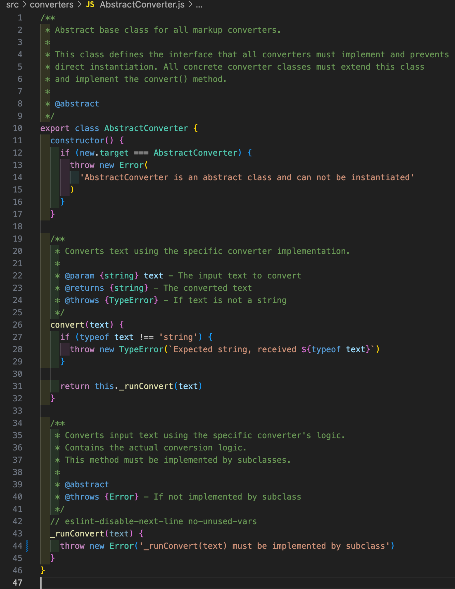

# Reflektion - Kodkvalitet

## Namngivning (Kapitel 2)

### Tabell - Analys av namn i publikt interface

| Namn | Typ | Förklaring | Reflektion och regler från Clean Code |
|------|-----|------------|----------------------------------------|
| `MarkupConverter` | Klassnamn | Huvudklassen som styr alla konverterare | **Use Intention-Revealing Names**: Namnet avslöjar tydligt att klassen konverterar markup. **Class Names**: Substantiv som beskriver vad objektet representerar. **Avoid Mental Mapping**: Ingen förvirring om vad klassen gör. |
| `HeadingConverter` | Klassnamn | Konverterar markdown-rubriker till HTML | **Use Searchable Names**: Lätt att söka efter i kodbasen. **Make Meaningful Distinctions**: Skiljer sig tydligt från andra konverterare genom "Heading"-prefixet. **Class Names**: Substantiv som beskriver specifik funktionalitet. |
| `convert(text)` | Metodnamn | Konverterar markdown-text till HTML | **Method Names**: Verb som beskriver vad metoden gör. **Use Intention-Revealing Names**: Tydligt att metoden konverterar något. **Function Arguments**: Parametern `text` är beskrivande och visar vad som ska konverteras. |
| `text` | Parameternamn | Input-parameter till convert-metoden som innehåller markdown-text | **Use Intention-Revealing Names**: Namnet visar tydligt att det är textinnehåll som ska bearbetas. **Avoid Mental Mapping**: "text" är tydligt att det betyder text. **Function Arguments**: Kort, beskrivande parameternamn som förklarar vad som förväntas. |
| `lines` | Variabelnamn | Används i metodsignaturer och som del av den interna logiken som exponeras | **Use Intention-Revealing Names**: Namnet förklarar tydligt att det är en array med textrader. **Avoid Abbreviations**: Inte förkortat till `lns` eller liknande. **Use Pronounceable Names**: Lätt att uttala och diskutera med andra utvecklare. |

### Reflektion kapitel 2

När jag analyserar min namngivning upptäcker jag att jag generellt följer Clean Code-principerna väl, men har några områden för förbättring. Min klassnamngivning följer **"Use Intention-Revealing Names"** och **"Class Names"**-reglerna genom att använda tydliga substantiv som `MarkupConverter` och `HeadingConverter`. 

En brist jag upptäckte var stavfelet i `firstOccurance` som borde vara `firstOccurrence`. Detta bryter mot **"Avoid Disinformation"**-regeln eftersom felstavning kan förvirra andra utvecklare. Den variablen finns dock inte längre kvar efter att jag refaktorerade metoden. Nu heter motsvarande `openingTag` vilket säger mer (firstOccurence av vadå?) Jag har också varit konsekvent med att undvika förkortningar och använder **"Searchable Names"** vilket gör koden lättare att navigera.

Lite mer generellt vad gäller readability vs understandability  lutar jag åt att det ofta är mer värt att göra texten lite mer svårläst genom att inte tvunget ha jättekorta variabelnamn. De får gärna vara lite längre om det ökar kodförståelsen.

Metodnamnen följer **"Method Names"**-regeln genom att vara verb (`convert`, `convertLine`) som tydligt beskriver vad de gör. Jag kunde förbättra genom att vara ännu mer specifik i vissa fall, till exempel kunde `convert` heta `convertMarkdownToHtml` för extra tydlighet, men jag bedömde att det blev för långt enligt **"Don't Add Gratuitous Context"**-regeln.

## Funktioner/Metoder (Kapitel 3)

### Tabell - Analys av längsta metoder

| Metodnamn | Kod/Länk | Antal rader | Reflektion |
|-----------|----------|-------------------|------------|
| `#convertInlineStyle(tag, line)` i `InlineStyleConverter` | [InlineStyleConverter.js:53-87](src/converters/InlineStyleConverter.js) | 27 | **Function Arguments**: Två argument (dyadic) vilket är acceptabelt. **Use Descriptive Names**: Parameternamnen `tag` och `line` beskriver tydligt vad de representerar. **Do One Thing**: Konverterar endast inline-markering. Metoden kunde förbättras genom att extrahera hjälpmetoder för att minska komplexiteten i while-loopen. |
| `#convertLine(line)` i `InlineStyleConverter` | [InlineStyleConverter.js:33-51](src/converters/InlineStyleConverter.js) | 15 | **Small**: Bra storlek. **Do One Thing**: Hanterar all inline-konvertering för en rad. **Use Descriptive Names**: Metodnamnet beskriver tydligt vad som händer. **One Level of Abstraction**: Delegerar specifik konverteringslogik till `#convertInlineStyle()`. Följer **Don't Repeat Yourself** genom att använda samma metod för alla inline-stilar. |
| `#getHeadingLevel(line)` i `HeadingConverter` | [HeadingConverter.js:49-58](src/converters/HeadingConverter.js) | 9 | **Small**: Bra storlek. **Do One Thing**: Räknar endast antalet '#'-tecken. **Function Names**: Namnet beskriver exakt vad funktionen returnerar. **Common Monadic Forms**: Tar ett argument och returnerar en beräkning baserad på det argumentet. **Use Descriptive Names**: Tydligt att den returnerar heading-nivån. |
| `convert(text)` i `ParagraphConverter` | [ParagraphConverter.js:21-41](src/converters/ParagraphConverter.js) | 16 | **Small**: Bra storlek. **Do One Thing**: Hanterar endast paragraf-konvertering. **Use Descriptive Names**: `textBlocks` och `taggedBlocks` beskriver tydligt vad variablerna innehåller. **One Level of Abstraction**: Delegerar detaljerad logik till hjälpmetoder som `#isListBlock()` och `#isHeadingBlock()`. |
| `convert(text)` i `HeadingConverter` | [HeadingConverter.js:24-33](src/converters/HeadingConverter.js) | 10 | **Small**: Bra storlek. **Do One Thing**: Konverterar endast rubriker och lämnar annat oförändrat. **Have No Side Effects**: Returnerar nytt värde utan att ändra input. **Use Descriptive Names**: `convertedLines` beskriver tydligt vad variabeln innehåller. **One Level of Abstraction**: Delegerar rubrikdetektering till `#isMarkdownHeading()`. |lista. **Function Names**: Namnet beskriver exakt vad funktionen gör. **Common Monadic Forms**: Ställer en fråga om argumentet och returnerar boolean. |

### Reflektion kapitel 3

Mina metoder följer generellt Clean Code-principerna mycket väl. De flesta är väldigt korta och följer **"Small"**-regeln. Jag har varit konsekvent med **"Do One Thing"**-principen där varje metod har ett tydligt, avgränsat ansvar. `#convertInlineStyletag()` är överlägset längst med sina 27 rader kod och den hade kunnat förkortas genom att bryta ut mindre hjälpfunktioner.

Koden följer **"Command Query Separation"** då mina metoder antingen returnerar värden eller utför åtgärder, aldrig båda samtidigt. Metoderna som `convert()` returnerar transformerad data utan att ändra det ursprungliga tillståndet.

Mina metodnamn följer **"Use Descriptive Names"** väl och namn som `#isListBlock()` och `#convertHeading()` förklarar exakt vad de gör. 

Jag använder också **"One Level of Abstraction"**-principen genom att delegera detaljerad logik till privata hjälpmetoder.
Clean Code trycker mycket på att bryta ut kod i små funktioner. Ett exempel som ges är att om du har en nästlad if-sats ska en funktion brytas ut. Jag har försökt följa detta och upplever faktiskt att koden blir mer lättläst om du samtidigt ger funktionen ett vettigt namn, och du kan "gömma" implementationen på den lägre abstraktionsnivån.

## Reflektion över egen kodkvalitet

Under utvecklingen av markup-converter har jag medvetet tillämpat Clean Code-principerna, vilket resulterat i kod som jag tycker är både läsbar och underhållbar. Genom att följa **"Single Responsibility Principle"** har jag skapat specialiserade konverterare där varje klass har ett tydligt, avgränsat ansvar. `HeadingConverter` hanterar t.ex endast rubriker medan `InlineStyleConverter` fokuserar på inline-formatering.

Min arkitektur följer **"Open/Closed Principle"** genom AbstractConverter-basklassen som gör det enkelt att lägga till nya konverterare utan att modifiera befintlig kod. Detta blev tydligt när jag refaktorerade från line-baserad till block-baserad bearbetning för vissa konverterare när ändringen inte krävde någon modifikation av andra klasser.

Sent i utvecklingen ville jag lägga till en enkel felhantering för att kasta undantag om någon converter får input som inte är en sträng och valde därför att lägga den valideringen i den publika `convert`-metoden för `AbstractConverter`, och låta den i sin tur ropa på en `#runConvert` som för varje converter innehåller konverteringslogiken. Tanken är att felhanteringslogiken då kan samlas på ett ställe och ärvs av alla converterare.
Eslint låter mig dock inte använda den nedärvda privata metoden utan jag fick göra även den metoden publik, men prefixade den med `_runConvert` för att signalera att den inte ska ses som en del i det publika interfacet. Det som händer om man skulle anropa den istället är alltså att man då bipasserar felhanteringen.  

Namngivningen tycker jag generellt har varit bra där jag konsekvent följt **"Use Intention-Revealing Names"** och **"Avoid Mental Mapping"**. Klassnamn som `ParagraphConverter` och metodnamn som `#isHeadingBlock()` gör koden självdokumenterande.

I princip alla metoderna följer **"Small"** och **"Do One Thing"**-principerna väl.

När det gäller dokumentation i form av JSDoc har jag valt att skriva sådana för de klasser och metoder som är en del av modulens publika interface, detta för att göra modulen enkel att förstå både för användare och utvecklare (t.ex jag själv i framtiden..). För interna metoder har jag istället förlitat mig på att tydlig namngivning i kombination med korta metoder ska göra koden "självdokumenterande"

Teststrategin med separata enhetstester för varje konverterare och integrationstester för hela pipeline:n följer **"Test Driven Development"**-tänket och gör det enklare att refaktorera. Detta fick jag själv exempel på när jag refaktorerade `#convertInlineStyle` i `InlineStyleConverter`. Ursprungligen hade jag tre snarlika metoder som gjorde samma sak, dvs söka igenom en sträng efter markdown-taggar och byta ut dem mot motsvarande html-tagg. Jag körde klassens enhetstester upprepade gånger och när testerna passerade kunde jag lita på att jag inte förstört något!

Jag tycker projektet visar att Clean Code-principerna förbättrar läsbarhet och gör koden mer robust och utbyggbar.

Så, jag är ett fan och kommer definitivt skriva bättre kod efter att ha läst boken och gjort dessa övningar!

Andreas