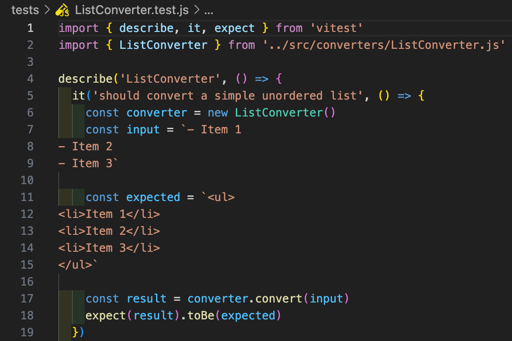
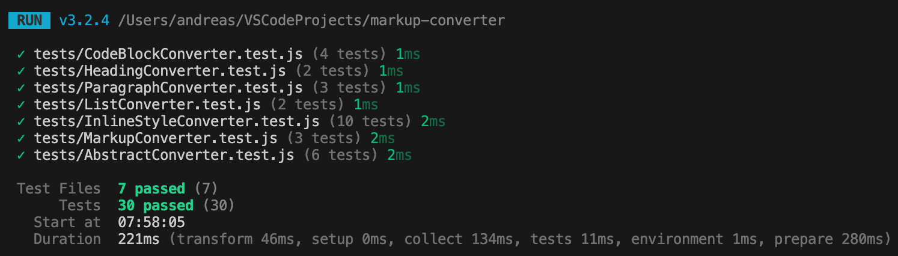

# Testrapport - release 1.0.0

## Testöversikt

Modulen har testats med en teststrategi som inkluderar både enhetstester för individuella konverterare och integrationstester för hela konverteringspipelinen. Alla tester körs med Vitest och kan utföras med kommandot `npm test`.

*Exempel: ett enhetstest för ListConverter*

## Testresultat

- **Totalt antal tester**: 30 testfall fördelade på 7 filer
- **Framgångsrika tester**: 100%
- **Misslyckade tester**: 0
- **Testtäckning**: Omfattar alla publika metoder
- **Teststrategi**: Kombination av enhetstester och integrationstester

Alla tester passerar.