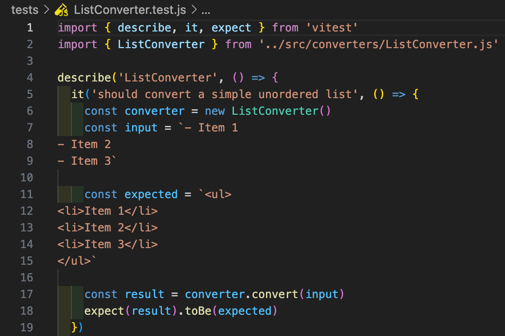
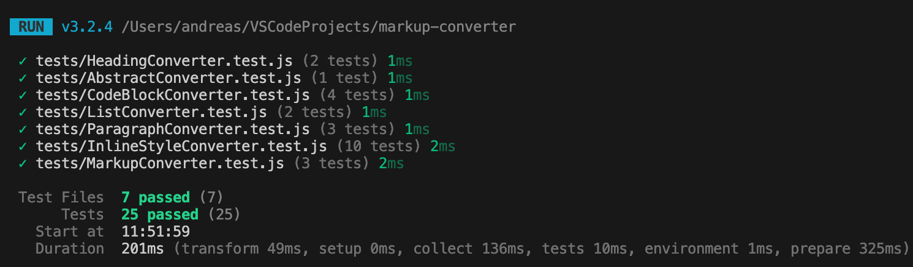

# Testrapport - release 1.0.0

## Testöversikt

Modulen har testats med en teststrategi som inkluderar både enhetstester för individuella konverterare och integrationstester för hela konverteringspipelinen. Alla tester körs med Vitest och kan utföras med kommandot `npm test`.



*Exempel: ett enhetstest för ListConverter*

## Testresultat

| Vad som testats | Hur det testats | Testresultat |
|----------------|-----------------|--------------|
| **HeadingConverter** - Konvertering av rubriker | Enhetstester med olika rubriknivåer (# ## ###), test av icke-rubriker som ska lämnas oförändrade | ✅ PASS - Alla rubriknivåer konverteras korrekt till HTML |
| **InlineStyleConverter** - Bold text (**text**) | Enhetstester med olika bold-kombinationer, text utan formatering | ✅ PASS - Bold konverteras till `<strong>` taggar |
| **InlineStyleConverter** - Italic text (*text*) | Enhetstester med italic text, blandad med annan formatering | ✅ PASS - Italic konverteras till `<em>` taggar |
| **InlineStyleConverter** - Strikethrough (~~text~~) | Enhetstester med strikethrough text, kombinationer med andra stilar | ✅ PASS - Strikethrough konverteras till `<del>` taggar |
| **InlineStyleConverter** - Inline code (`code`) | Enhetstester med inline code, test i kombination med annan formatering | ✅ PASS - Inline code konverteras till `<code>` taggar |
| **CodeBlockConverter** - Code blocks (``` code ```) | Enhetstester med flerradiga kodblock | ✅ PASS - Kodblock konverteras till `<pre><code>` struktur |
| **ListConverter** - Unordered lists (- item) | Enhetstester med flerradiga listor | ✅ PASS - Skapar korrekt `<ul><li>` struktur |
| **ListConverter** - Ordered lists (1. item) | Enhetstester med numrerade listor | ✅ PASS - Skapar korrekt `<ol><li>` struktur |
| **ParagraphConverter** - Paragraph wrapping | Enhetstester som verifierar att vanlig text wrappas i `<p>` taggar medan HTML-element lämnas opåverkade | ✅ PASS - Textstycken wrappas korrekt i paragrafer |
| **MarkupConverter** - Komplett pipeline | Integrationstester med dokument som innehåller alla markdown-element samtidigt | ✅ PASS - Alla konverterare arbetar tillsammans korrekt |
| **MarkupConverter** - Konverteringsordning | Integrationstester som verifierar att konverterare körs i rätt ordning för att undvika konflikter | ✅ PASS - Heading → CodeBlock → List → Paragraph → InlineStyle ordning fungerar |
| **MarkupConverter** - Komplex markdown | Integrationstester med stort dokument med blandade element | ✅ PASS - Hanterar komplexa dokument med alla markdown-features |

## Testresultat sammanfattning



- **Totalt antal tester**: 25 testfall fördelade på 7 filer
- **Framgångsrika tester**: 100%
- **Misslyckade tester**: 0
- **Testtäckning**: Omfattar alla publika metoder
- **Teststrategi**: Kombination av enhetstester och integrationstester

Alla tester passerar.